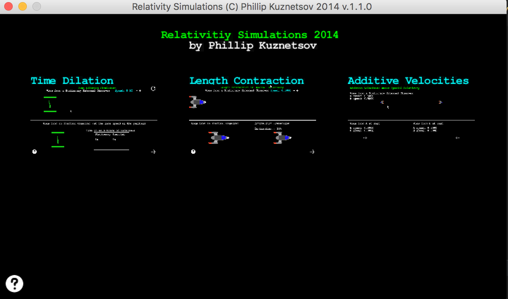
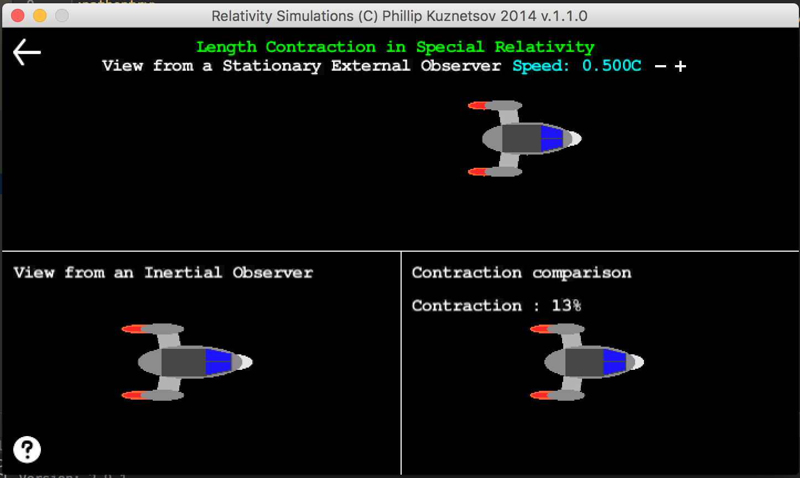
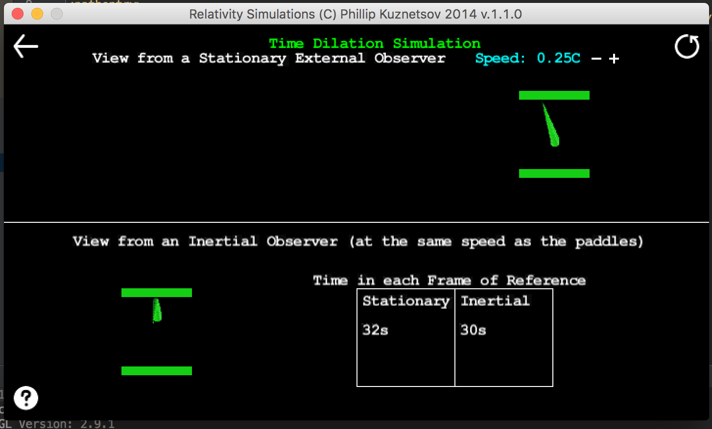
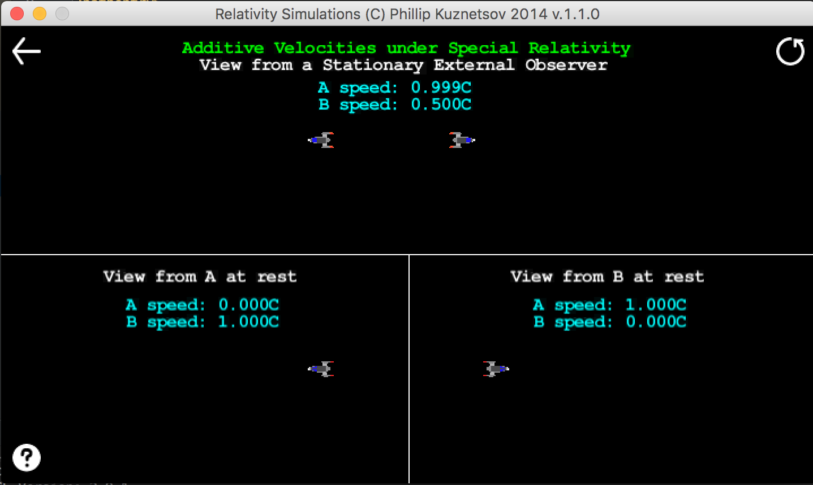

# Relativity Simulations
This project was built for my 2014 IB CompSci Internal Assessment.

Simulates different properties of special relativity through spaceships!

Using the interface is fairly intuitive, simply click the different simulation you want to run, adjust the parameters using the +/- buttons, and use the back arrow to return to the menu.

Every screen also has a help button in case you want to use shortcuts.
## Screenshots
### Landing Screen

### Time Dilation

### Length Contraction

### Additive Velocities

## How to Compile

Built using [Slick2D](http://slick.ninjacave.com/) and [LWJGL 2](https://www.lwjgl.org/). To compile everything, you'll need to make sure you add all jars in lib/ and then include the natives location for your OS in your java class path
